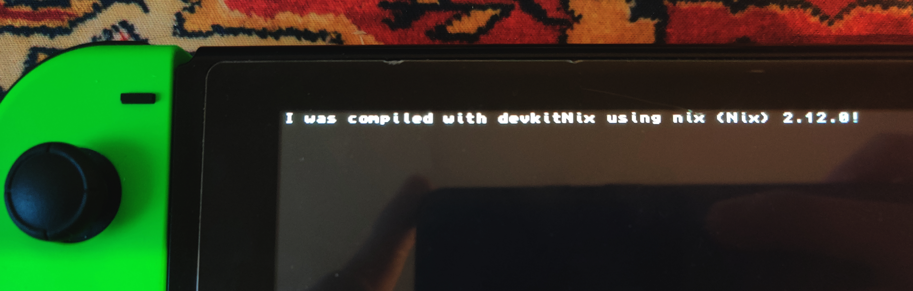

This flake allows you to use [devkitPro](https://devkitpro.org/) toolchains in your Nix expressions.

# Usage

devkitNix works by extracting dkp's official Docker images, patching the binaries and including everything in a single environment. Each package provides a complete toolchain including all available portlibs.

To use the toolchains, create a `flake.nix` file and import devkitNix as shown in the example below:

```nix
# This is an example flake.nix for a Switch project based on devkitA64.
# It will work on any devkitPro example with a Makefile out of the box.
{
  inputs = {
    nixpkgs.url = "github:NixOS/nixpkgs/nixpkgs-unstable";
    flake-utils.url = "github:numtide/flake-utils";
    devkitNix.url = "github:bandithedoge/devkitNix";
  };

  outputs = {
    self,
    nixpkgs,
    flake-utils,
    devkitNix,
    ...
  }:
    flake-utils.lib.eachDefaultSystem (system: let
      pkgs = import nixpkgs {
        inherit system;
        # devkitNix provides an overlay with the toolchains
        overlays = [devkitNix.overlays.default];
      };
    in {
      # devkitNix provides standard environments which set all the necessary variables and add dependencies.
      # No more shell hooks!
      devShells.default = pkgs.mkShell.override {stdenv = pkgs.devkitNix.stdenvA64;} {};

      packages.default = pkgs.stdenv.mkDerivation {
        name = "devkitA64-example";
        src = ./.;

        # The `TARGET` variable is used by devkitPro's example Makefiles to set the name of the executable.
        makeFlags = ["TARGET=example"];
        # This is a simple Switch app example that only builds a single
        # executable. If your project outputs multiple files, make `$out` a
        # directory and copy everything there.
        installPhase = ''
          mkdir $out
          cp example.nro $out
        '';
      };

    });
}
```

See the [examples](examples/) directory for complete working homebrew apps.
